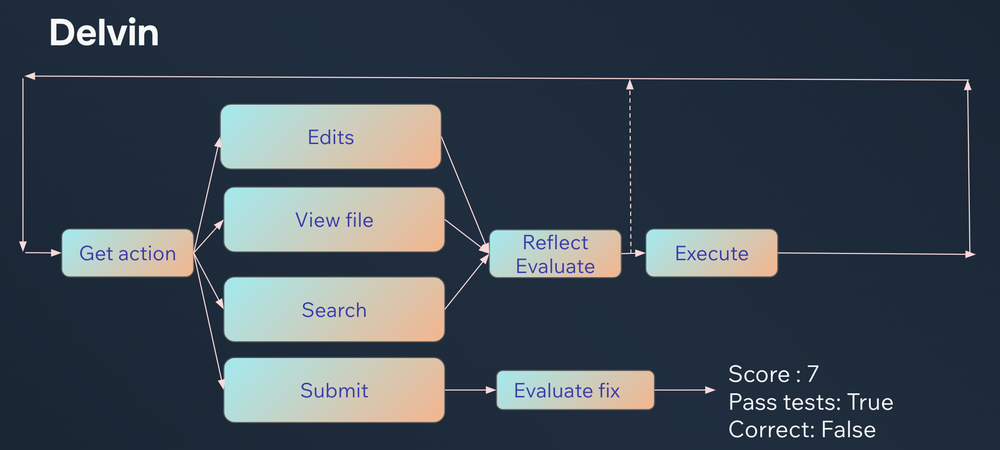

<p align="center">
  
</p>

# Delvin


A program _trying_ to solve tasks from the [SWE-bench Lite](https://huggingface.co/datasets/princeton-nlp/SWE-bench_Lite/viewer/default/dev?row=22) dataset with simple actions

Achieves 23% pass on SWE Bench Lite through LLM eval, so take that result with a grain of salt!


# Requirements

- Python 3.9+
- `git`
- An [Opper](https://opper.ai) API key

# Run it

```bash
python main.py
```


# How does it work?


<p align="center">
  
</p>

Delvin is simple agent that can view, edit, and search files. Every action goes through a reflection stage and results from the environment (bad diffs, linting errors) are fed back to the model.

We use the [Opper](https://opper.ai) SDK to easily build structured functions. No dirty parsing needed :)


